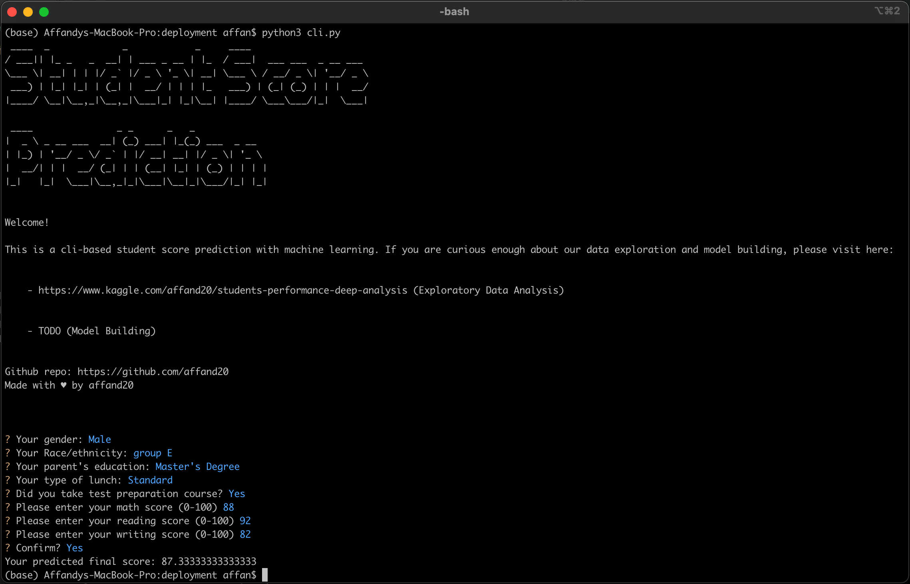
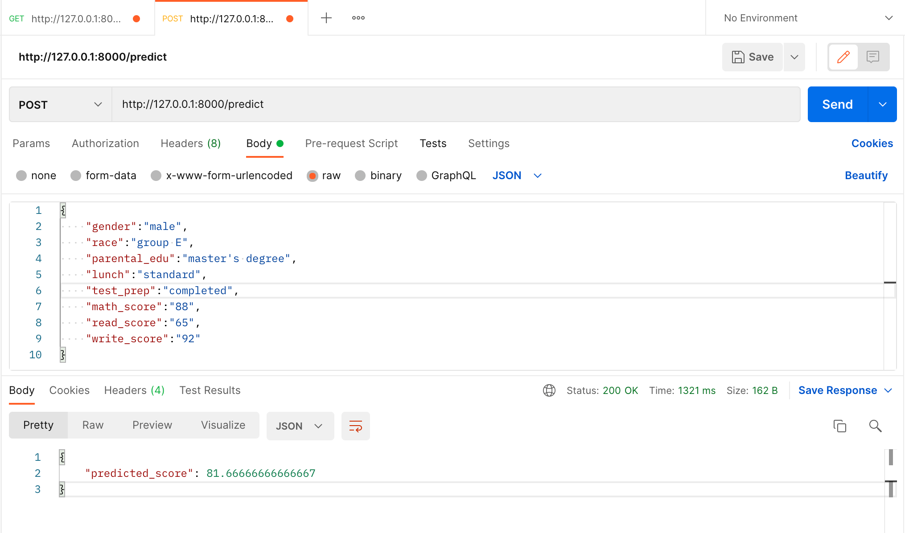

# Students Performance Analysis

This data set consists of the marks secured by the students in various subjects. Here we will try to understand the influence of the parents background, test preparation etc on students performance. Also we will try to analyze is there are any socio-economic pattern that could affect students to perform better on the exam.

<br>

This is my very first public notebook data exploration. Please leave comments or suggestions to improve this notebook and give me another insight. Hope you like it 😊

**Kaggle Dataset Link:** [https://www.kaggle.com/spscientist/students-performance-in-exams](https://www.kaggle.com/spscientist/students-performance-in-exams)

**Notebook Link:** [https://www.kaggle.com/affand20/students-performance-deep-analysis](https://www.kaggle.com/affand20/students-performance-deep-analysis)

<br>

# CLI-based Model Inference
I'm also made a simple CLI-based model inference where you can try to run this model by yourself locally.



## Installation
```
git clone https://github.com/affand20/students-performance
cd student-performance/deployment
pip install -r requirements.txt
```

## Run Model Inference
```
python3 cli.py
```

If you're curious of how I created the model, you can take a look at my prediction notebook at `notebook` folders or just click [here](https://github.com/affand20/students-performance/blob/master/notebooks/students-performance-prediction.ipynb)

<br>

# RESTful API Based Model Inference
Make sure you have installed the following packages listed on `requirements.txt`. Run this command to install the packages.
```
cd student-performance/deployment
pip install -r requirements.txt
```
Or simply just follow the Installation steps above.

<br>

How to run:
```
cd deployment
uvicorn app:app --reload
```
Go to browser and visit `http://127.0.0.1:8000`
<br><br>

## Available API
```
GET /predict?gender=male&race=group E&parental_edu=master's degree&lunch=standard&test_prep=completed&math_score=88&read_score=65&write_score=92
```
```
POST /predict
```
| Parameter/Body | Type | Available Value | Description |
| --------- | ---- | ---------------- | ----------- |
| `gender`  | `string` | Male, Female  | Student's gender.
| `race`    | `string` | group A, group B, ... group E  | Student's race/ethnicity.
| `parental_edu`    | `string` | Master's Degree, Bachelor's Degree, Associate's Degree, Some College, High School, Some High School  | Student's parent education level.
| `lunch`    | `string` | Standard, Free/reduced  | Student's lunch type.
| `test_prep`    | `string` | Completed, None  | Student's taking test preparation course status.
| `math_score`    | `int` | 0-100  | Student's Math subject score.
| `read_score`    | `int` | 0-100  | Student's Reading subject score.
| `write_score`    | `int` | 0-100  | Student's Writing subject score.

The API available in 2 methods `POST` and `GET`. Both using the same path `/predict` and using the same list parameters. For the `GET` method, you should insert parameter as **Query Parameter**, while for the `POST` method, you have to insert parameter as **Request Body**.

<br>

## Responses
```
{
    "predicted_score": 81.66666666666667
}
```

<br>

## Example
- **curl**
```
curl -X POST "http://0.0.0.0:8000/predict" -H  "accept: application/json" -H  "Content-Type: application/json" -d "{\"gender\":\"male\",\"race\":\"group E\",\"parental_edu\":\"master's degree\",\"lunch\":\"standard\",\"test_prep\":\"completed\",\"math_score\":88,\"read_score\":65,\"write_score\":92}"
```
- **Postman**


<br>
<br>

# Get in Touch
If you are interested to give me any suggestions, comments, or discuss projects, works, anything please contact me at:

- Mail: fahri.lafa@gmail.com
- Linkedin: https://www.linkedin.com/in/affandyfahrizain/


### Thank you!